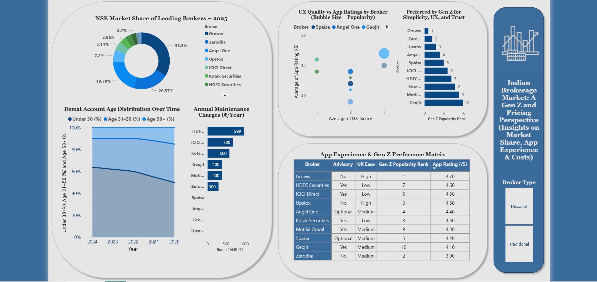

# Gen Z Investor Behaviour & Brokerage Market Analysis (Power BI)

## Business Objective
This project analyzes how pricing strategies, app experience, and brokerage models influence Gen Z investor preferences in India.

## Dataset Sources
SEBI client account statistics  
NSE market share reports  
Broker websites pricing data  
Google Play Store app ratings and downloads

## Tools Used
Power BI  
Data Visualization  
Business Intelligence Analytics

## Key Insights
- Discount brokers dominate market share among Gen Z investors.
- Zero AMC and flat brokerage pricing models attract younger investors.
- App experience and UX significantly influence platform adoption.

## Outcome
The Power BI dashboard visualizes brokerage competition and helps understand how digital-first platforms are reshaping India's brokerage industry.
